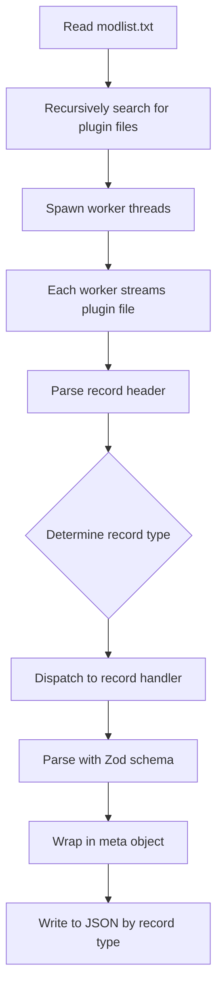

# Skyrim Extractor Architecture

## Overview
This project parses Skyrim ESP/ESM plugin files in a functional, multithreaded, and schema-validated (Zod) manner. It is designed for large modlists, with each plugin processed in parallel and all records output as JSON, grouped by type and wrapped in a standard meta object.

---

## Project Structure

```
skyrim-extractor/
├── src/
│   ├── main.ts                # Entry point, orchestrates the pipeline
│   ├── modlist.ts             # Load order parsing (recursively finds plugin files)
│   ├── worker.ts              # Worker thread logic for plugin parsing
│   ├── plugin/
│   │   ├── index.ts           # Plugin parsing logic
│   │   ├── record-meta.ts     # Meta wrapper interface
│   │   └── record-handlers/   # One file per record type parser (e.g., TES4.ts, GRUP.ts, etc.)
│   ├── output/                # (generated JSON files)
│   └── utils/                 # Buffer helpers, stream utilities, etc.
├── modlist.txt                # At the root
├── ModA/                      # Extracted mod folders
│   └── SomePlugin.esp
├── ModB/
│   └── AnotherPlugin.esm
├── Skyrim/
│   └── Skyrim.esm
├── package.json
├── tsconfig.json
└── README.md
```

---

## Modlist Loader & Plugin Discovery
- `modlist.txt` is at the project root.
- Each line is a plugin filename (ignoring comments and blanks).
- For each plugin, the loader recursively searches all subdirectories from the root to find the first matching file (case-insensitive).
- The loader returns an array of:

```ts
export interface ModlistEntry {
  filename: string;    // Plugin filename from modlist.txt
  loadOrder: number;   // Order in the modlist
  fullPath: string;    // Resolved absolute path to the plugin file
}
```

If a plugin is not found, an error is thrown.

---

## High-Level Flow



---

## Meta Wrapper
All parsed records are wrapped in a standard meta object for consistency:

```ts
export interface RecordMeta<T> {
  plugin: string;         // Which plugin this record came from
  loadOrder: number;      // Plugin's position in the modlist
  recordType: string;     // e.g., "ARMO", "WEAP"
  formId: string;         // The FormID of the record
  rawOffset: number;      // Byte offset in the file (optional)
  parsed: T;              // The parsed record data
}
```

---

## Functional Programming
- All parsing logic is pure and stateless (functions in, data out).
- No side effects in parsing functions; I/O is handled at the orchestration level.
- Use higher-order functions and composition for stream and buffer processing.

---

## Multithreading
- Node.js `worker_threads` are used for parallel plugin processing.
- Main thread: reads modlist, spawns workers, collects results.
- Each worker: processes one plugin, streams records, writes output.

---

## Zod for Schema Validation
- Each record handler exports a Zod schema and a parse function.
- The parse function validates and infers types using Zod, returning a meta-wrapped result.

---

## Output
- JSON files are written by record type (e.g., `output/ARMO.json`, `output/WEAP.json`).
- Each entry is a meta-wrapped record, ready for further pipeline processing. 