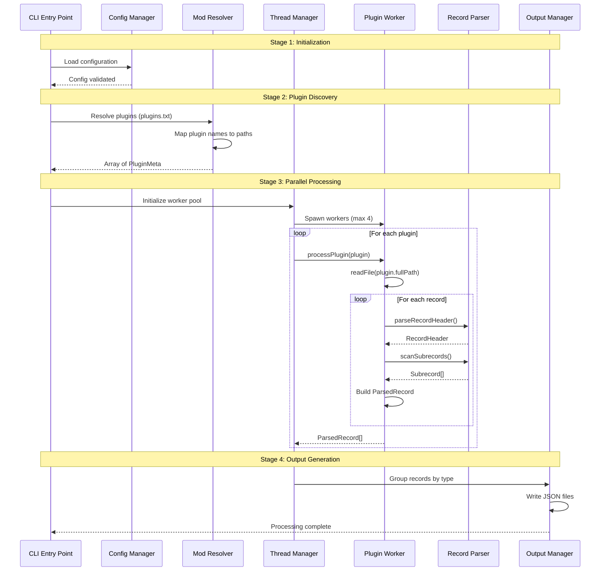

# Skyrim Plugin Processing Pipeline

This document outlines the high-level processing pipeline for Skyrim plugin files, showing the main stages and entry points.



## Pipeline Stages

### 1. Initialization
- **Entry Point**: `src/cli.ts`
- **Key Components**:
  - CLI argument parsing
  - Configuration loading
  - Environment validation

### 2. Plugin Discovery
- **Entry Point**: `src/modResolver.ts`
- **Key Components**:
  - Reading plugins.txt
  - Mapping plugin names to file paths
  - Building PluginMeta objects

### 3. Parallel Processing
- **Entry Point**: `src/thread/threadManager.ts`
- **Key Components**:
  - Worker thread pool management
  - Plugin distribution
  - Record parsing coordination

### 4. Output Generation
- **Entry Point**: `src/output/fileOutput.ts`
- **Key Components**:
  - Record grouping by type
  - JSON file generation
  - Output directory management

## Key Interfaces

### PluginMeta
```typescript
interface PluginMeta {
  name: string;        // e.g., 'Requiem.esp'
  fullPath: string;    // absolute path to plugin binary
  modFolder: string;   // which mod the plugin came from
  index: number;       // load order index from plugins.txt
}
```

### ParsedRecord
```typescript
interface ParsedRecord {
  meta: {
    type: string;   // e.g., 'PERK'
    formId: string; // e.g., '00058F80'
    plugin: string; // e.g., 'Requiem.esp'
  };
  data: Record<string, Buffer[]>; // Subrecord content by subrecord ID
  header: string; // Raw 20-byte record header in base64
}
```

## Notes
- Each stage is designed to be independent and testable
- The pipeline uses worker threads for parallel processing
- Memory management is handled at the worker level
- Output is streamed to disk to manage memory usage 