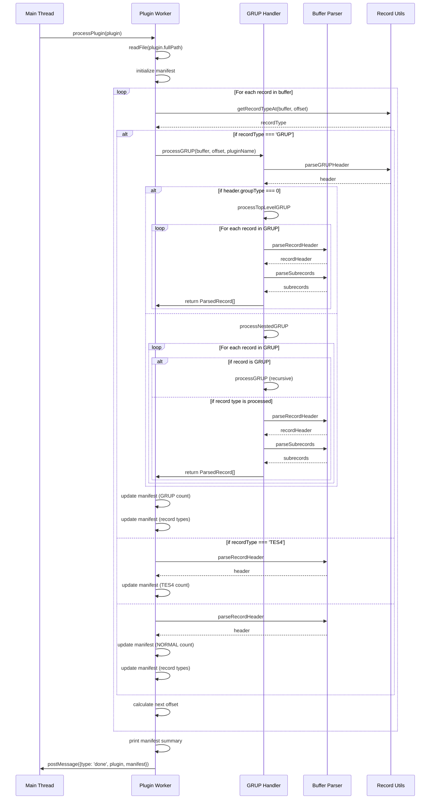

# Plugin Worker Processing Sequence

## Key Points

1. **Initial Setup**
   - Main thread sends plugin to worker
   - Worker reads file and initializes manifest

2. **Record Processing Loop**
   - Each record type has its own path
   - GRUPs are handled recursively
   - Manifest is updated for each record

3. **GRUP Processing**
   - Top-Level GRUPs (type 0) are handled differently
   - Nested GRUPs require type checking
   - Records are filtered by type

4. **Manifest Updates**
   - Record counts (TES4, GRUP, NORMAL)
   - Group type counts
   - Record type counts

5. **Completion**
   - Summary is printed
   - Results are sent back to main thread 